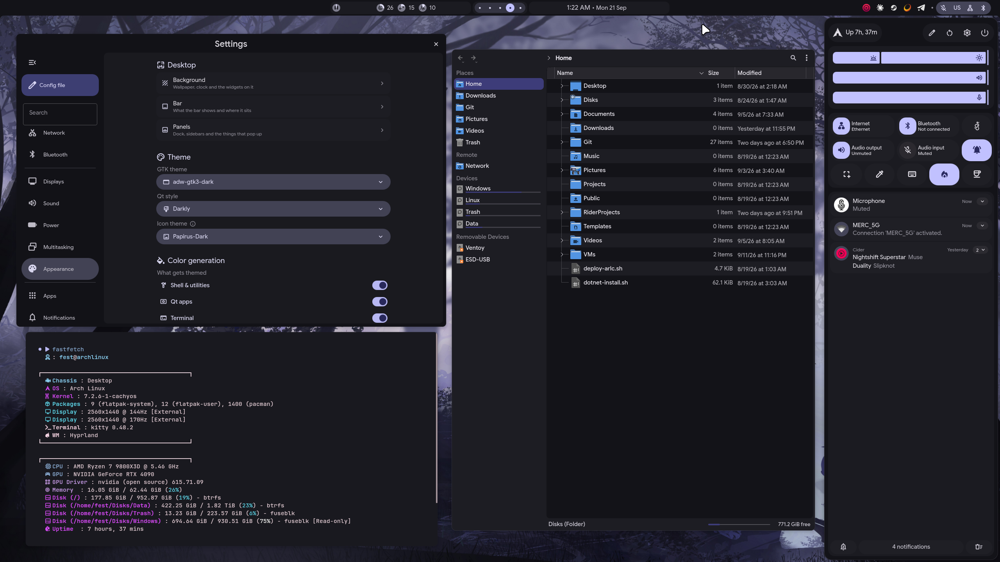

    <h1>【 My fork of end_4's Hyprland dotfiles 】</h1>
    <h3></h3>

 

    <h2>• overview •</h2>
    <h3></h3>

 
  
What this is/isn't

  - Technically, configuration files
  - Realistically, mostly the custom graphical shell
  - NOT a system setup script: no graphic drivers, no zram setup, etc.
  

 
  
Notable features

     
  - **Overview**: Shows open apps with live previews
  - **Material themes**: Choose your wallpaper, done, enjoy
  - **Settings in the shell**: Seventeen pages, from Wi-Fi to display arrangement
  - **Transparent installation**: Every command is shown before it's run

 
  
Installation

   - **Arch only.** `arch`, `endeavouros` and `cachyos` are taken by name, anything that
     reports `arch` in `ID_LIKE` is taken with a warning, and everything else stops the
     installer. Architectures other than x86_64 warn and carry on
   - **Hyprland 0.55 or newer**, because the Hyprland config here is the Lua one
   - Clone this repo and run `./setup install`
     - The one-line `bash <(curl -s https://ii.clsty.link/get)` installs upstream, not this fork
     - See [the wiki](https://ii.clsty.link/en/ii-qs/01setup/) for what the steps do
   - **Keybinds**: Should be somewhat familiar to Windows or GNOME users. Important ones:
     - `Super`+`/` = keybind list
     - `Super`+`Enter` = terminal

  
Software overview

  | Software | Purpose |
  | ------------- | ------------- |
  | [Hyprland](https://github.com/hyprwm/hyprland) | The compositor (manages and renders windows) |
  | [Quickshell](https://quickshell.outfoxxed.me/) | A QtQuick-based widget system, used for the status bar, sidebars, etc. |
  | Others | See [deps-info.md](https://github.com/The1fEst/dots-hyprland/blob/main/sdata/deps-info.md) |

    
Discord

        <a href="https://discord.gg/GtdRBXgMwq"> Server link</a> | I hope this provides a friendlier environment for support without needing me to personally accept every friend request/DM. For real issues, prefer GitHub

    <h2>• what this fork is •</h2>
    <h3></h3>

An Arch-only build of illogical-impulse that keeps its work on the machine and puts the
desktop's settings inside the shell. Everything not described below comes from upstream.

  
The shell

  One Quickshell config, `ii`, draws every panel and window.

  - **Bar** — workspaces, system tray, clock, media, resources, battery, unread
    notifications, the keyboard layout in upper case, weather, and a count of pending
    updates read from `checkupdates`. The clock opens the calendar panel, and a vertical
    variant of the bar carries the clock, media, resources and battery
  - **Dock** — icons pin, unpin and reorder by dragging
  - **Right sidebar** — notifications, volume mixer, night light, Wi-Fi networks,
    Bluetooth devices, WireGuard connections, and quick toggles that are added, removed
    and rearranged by dragging
  - **Session screen** — lock, sleep, hibernate, log out, reboot, shut down, and **Reboot
    to Windows**, backed by `scripts/system/boot-next-windows.sh`. It arms a one-shot UEFI
    `BootNext` at the Windows Boot Manager and reboots. The firmware clears `BootNext` on
    the next boot, so a failed Windows boot comes back to Linux. Reading the boot list
    needs no privileges and only writing the variable goes through `pkexec`, so the
    shell's polkit agent asks for the password. To skip that prompt, allow the one call in
    `/etc/sudoers.d` and swap `pkexec` for `sudo -n` in the script
  - **Lock screen** — the account's full name when one is set, the keyboard layout in
    upper case, battery, and fingerprint when the reader is configured. The hyprlock
    fallback ships alongside it and shows a 12-hour clock
  - **Region selector** — a mode panel and an options menu for pointer capture, a
    countdown, a remembered region, window and layer targets, and the outline of a
    rectangle or a circle. Whether a shot is also written to a file is a setting, and
    Satty takes it for annotation
  - **Welcome window** — sets up displays, sound and power saving on the first run
  - Overview, media controls, on-screen keyboard and display, wallpaper selector, cheat
    sheet, notification popups, screen corners and a polkit agent round it out

  
Settings

  A window inside the shell, closed with `Escape`, holding seventeen pages: Quick, Wi-Fi,
  Network, Bluetooth, Displays, Sound, Power, Multitasking, Appearance, Apps,
  Notifications, Search, Mouse & Touchpad, Keyboard, Accessibility, Privacy & Security and
  System. Between them, they reach the options that otherwise live only in `config.json`,
  and they cover ground that would otherwise need `kcmshell6`: the account password,
  display arrangement, WireGuard, Hyprland's three Auto HDR modes, and the alert sound
  theme picked from the themes that are installed.

  The About page names the machine, its graphics card and a card per mounted disk, along
  with this fork and the upstream it came from.

  
What leaves the machine

  - **Weather** — `wttr.in`, with GPS coordinates when `enableGPS` is set. Off by default
  - **Album art** — downloaded from the URL the MPRIS player reports
  - The installer fetches `uv` from `astral.sh` and cursors from GitHub releases

  Nothing else in `dots/` makes an outgoing request. There is no AI, no OCR, no web search
  in the launcher or the start menu, no remote wallpaper source, and no screen translator.

  
Packaging and setup

  - **Arch only**, through the `illogical-impulse-*` meta packages under
    `sdata/dist-arch`. `makepkg` cleans its work directories after each build, so nothing
    is left behind in the repository
  - The venv holds sixteen Python packages, eleven of them named directly:
    `build`, `pillow`, `setuptools-scm`, `wheel`, `kde-material-you-colors`,
    `materialyoucolor`, `click`, `loguru`, `pycairo`, `pygobject` and `tqdm`
  - `illogical-impulse-apps` carries the applications the shell hands work to rather than
    uses itself: GNOME Calendar for `text/calendar`, Thunderbird for `mailto` and VLC for
    video and audio. Directories open in Dolphin, pictures in Satty
  - `power-profiles-daemon` is installed, so the power profile controls have a daemon to
    talk to
  - NetworkManager is enabled by the installer, unless the machine already has another
    network manager enabled
  - EasyEffects is installed but not autostarted; the sidebar toggle starts it
  - The systemd user units the shell relies on ship with it: `quickshell`, `hypridle`,
    `cliphist-text`, `cliphist-image` and `wl-clip-persist`, all hanging off
    `hyprland-session.target`
  - `colors.lua` and `hyprlock/colors.conf` are not tracked — matugen regenerates them on
    every wallpaper change

  
Odds and ends

  - **Fonts** — the interface is Google Sans, so non-Latin text keeps a proper face; the
    background clock has its own family and is set to Google Sans Flex
  - **Clipboard** — `cliphist` keeps the history and `wl-clip-persist` holds the clipboard
    after the program that filled it exits. Images get their own preview row, and vendor
    blobs stay out of the list
  - **Media keys** — they drive the shell over its IPC socket
  - `scheme_for_image.py` reads colors through PIL

    <h2>• screenshots •</h2>
    <h3></h3>

    

Widget system: Quickshell | Support: Yes

[Showcase video](https://www.youtube.com/watch?v=RPwovTInagE)

    <h2>• thank you •</h2>
    <h3></h3>

 - [@end-4](https://github.com/end-4) for the dotfiles this fork is built on
 - [@clsty](https://github.com/clsty) for making the dotfiles accessible by taking care of the install script and many other things
 - [@midn8hustlr](https://github.com/midn8hustlr) for greatly improving the color generation system
 - [@outfoxxed](https://github.com/outfoxxed/) for being extremely supportive in my Quickshell journey
 - Quickshell: [Soramane](https://github.com/caelestia-dots/shell/), [FridayFaerie](https://github.com/FridayFaerie/quickshell), [nydragon](https://github.com/nydragon/nysh)
 - AGS: [Aylur](https://github.com/Aylur/dotfiles/tree/ags-pre-ts), [kotontrion](https://github.com/kotontrion/dotfiles)
 - EWW: [fufexan](https://github.com/fufexan/dotfiles)

    <h2>• stonks •</h2>
    <h3></h3>

- I promise not to attempt an +ULTRARICOSHOT irl... Coins can go here: https://github.com/sponsors/end-4
- Tentacle cat hub twinkle internet points

---

    <h2>• previous styles •</h2>
    <h3></h3>

- **Unsupported!**
- **Source**: illogical-impulse AGS in `ii-ags` branch, others in `archive` branch.
- List is in reverse chronological order

### illogical-impulse (AGS)

Widget system: AGS | Support: No

| AI | Common widgets |
|:---|:---------------|
|  |  |
| Window management | Weeb power |
|  |  |

#### m3ww

Widget system: EWW | Support: No

#### NovelKnock

Widget system: EWW | Support: No

#### Hybrid

Widget system: EWW | Support: No

#### Windoes

Widget system: EWW | Support: No

    <h2>• inspirations/copying •</h2>
    <h3></h3>

 - Inspiration: osu!lazer (Hybrid), Windows 11 (Windoes), AvdanOS (NovelKnock), Material Design 3 (m3ww & later)
 - Copying: Absolutely, feel free. Just follow the license and it's all good
 
